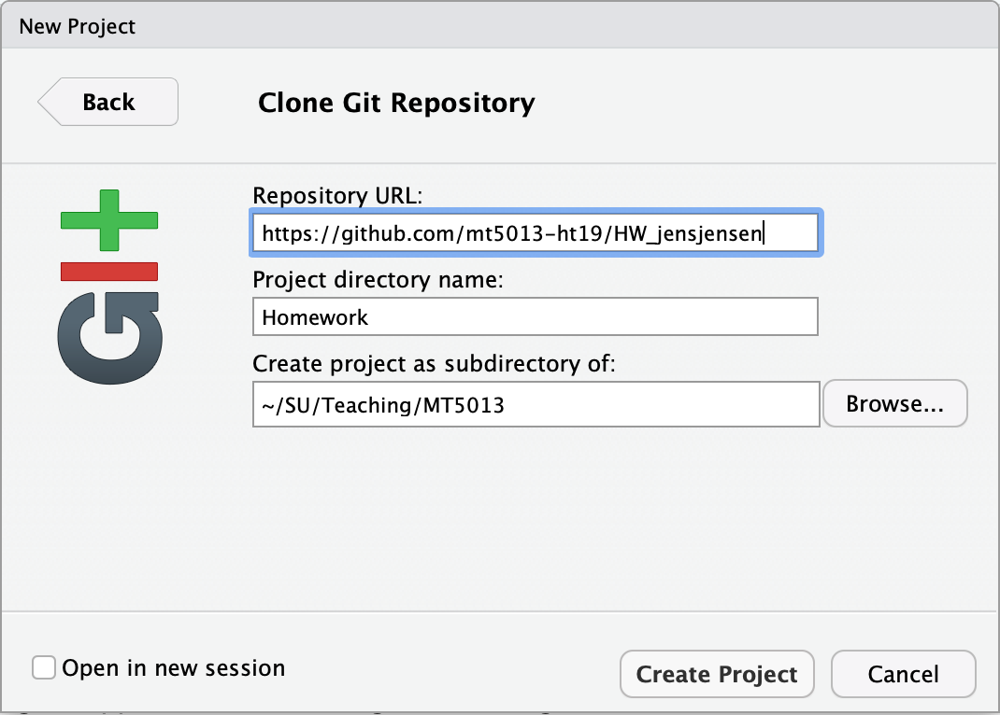
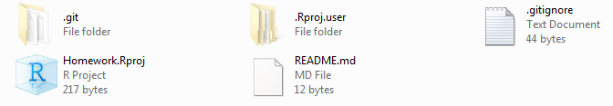
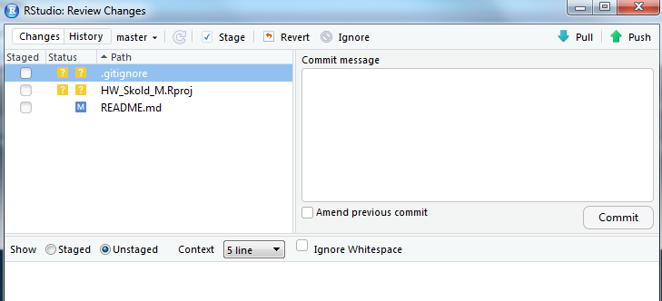
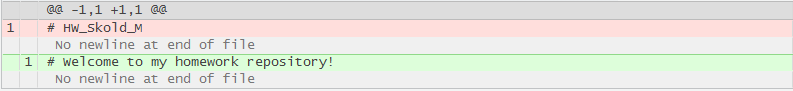
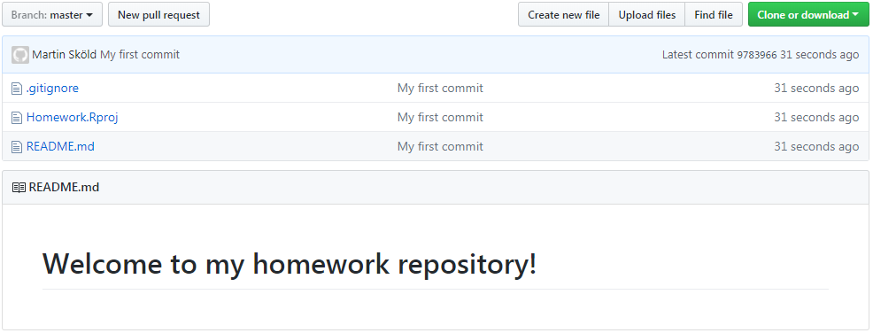

```{r setup, include=FALSE}
knitr::opts_chunk$set(echo = TRUE)
```

## Do this before class

### Register on DataCamp and GitHub

As preparation for most classes, you are expected to complete exercises on [DataCamp](https://www.datacamp.com/home). Registered students will get free access to their premium content for 6 months,  but we need to supply them with your email in order for an invite to be sent. You will also need an account on [GitHub](https://github.com/) (the free plan works fine), where all your assignments should be uploaded during the course. GitHub is an excellent place to showcase your coding skills for potential future employers, so choose your username wisely.

**Set up your GitHub account, then enter your GitHub user name and email (for an invite to DataCamp) in** [**this form**](https://kurser.math.su.se/mod/feedback/view.php?id=46147).

Note: In case you already have a Data Camp account, make sure to specify the same address you have used to register the existing Data Camp account.
When you have received an invite to DataCamp (we enter this manually, so it could take a day or two), this course should appear under your [groups](https://www.datacamp.com/enterprise). Try a few chapters of the [Introduction to R](https://www.datacamp.com/courses/free-introduction-to-r) course to freshen up your R skills and try the format.

### Computers

During class we will work on laptops in an ordinary lecture room. Please bring a laptop.
<!-- If you do not have access to a laptop, you can borrow one from the department during class hours **if you notify the teaching staff at the latest the day before class**.    -->

### Software installation

First make sure you have fresh versions of [R](https://cran.r-project.org/) and [RStudio Desktop](https://www.rstudio.com/products/rstudio/#Desktop) installed. You will also need Git, download this from <https://git-scm.com/downloads> and install.

After installation, you need to introduce yourself to Git. Do so by opening a [shell](https://en.wikipedia.org/wiki/Unix_shell)  (e.g. by **Tools > Shell ...** in RStudio) and enter

```
git config --global user.name "Jens Jensen"
git config --global user.email "jens.jensen@math.su.se"
```

with the information about Jens Jensen replaced by your own credentials, i.e. your name and your email address. You must use the same email address as you did when registering your GitHub account.

## Class activities

### Connecting RStudio and Github

*In which we create an R project connected to our Github Homework repo.* 

You now have

* A GitHub account.
* A Homework repository in the course organisation (e.g. <https://github.com/mt5013-ht19/HW_jensjensen>).
* The latest versions of R, RStudio and Git installed.
* Introduced yourself to Git.

It is time to make RStudio and GitHub talk. First, make sure you have a folder on your computer that is devoted to your work in this course. Start a Web-browser and navigate to your GitHub homework repository, click the green **Clone or download** button and copy the displayed URL. 

Start RStudio and choose **File > New project > Version Control > Git**. This opens a window like the one below.



<p>In the field *Repository URL:* you paste the URL of your github Homework directory (`HW_<yourgithubusername>`) copied above, in *Project directory name:* you enter the name of your homework folder (you do not need to create the folder) and in *Create project as subdirectory of:* you enter your course folder.

Now click the create **Create Project** button and check what has happened with your course folder, it should have files like below:



The folder `.git` is where Git keeps track of everything (leave this alone), `.Rproj.user` contains temporary files and computer/use-specific stuff (leave this alone). Further, `.gitignore` contains a list of files that Git should not keep track of, open and check it out! You will see that, among other things, Git ignores the `.Rproj.user` folder by default. It also does not track `.git`, that would be tracking itself, but that is not optional and hence not listed in the `.gitignore`. `Homework.Rproj` contains some project-specific settings and, finally, `README.md` is a clone of the Markdown file in your GitHub repo.


### Committing a change

Open `README.md` in RStudio and add a welcoming message to it. Save the edited file and go to **Tools > Version Control > Commit ...**. This will open a new window containing the files that differ from what you just cloned from GitHub.



There are three files (`.git`and `.Rproj.user` are ignored)

* `.gitignore` and `Homework.Rproj` has question-marks since they are not part of the repository downloaded from GitHub and you have not yet told Git to keep track of them.
* `README.md` has an *M* since it is part of the repository and *M*odified.

Click `README.md` and you will see the changes you made to the file in green (old version in red).



If the changes look ok, you want to *commit* them. You also want to add `.gitignore` and `Homework.Rproj` to the repo. Do so by checking all three boxes in the Staged-column and writing a commit message to the right describing why the change was made ("My first commit" will do fine for now) and click the **Commit** button. This should result in a "Git Commit" window being opened, hopefully showing a success. You may close this. 

By committing the changes, `README.md` has been updated to a new "latest working version" on the local (i.e. on your filesystem) instant of the Homework repository. Also, `.gitignore` and `Homework.Rproj` have been added. The files have disappeared from RStudios *Review Changes* window since it they are now up to date with the repository (no changes made since last commit).

To update the repository on GitHub, choose **Tools > Version Control > Push Branch** in RStudio.
Go to GitHub and check, it should look something like this:



Note that GitHub displays a rendered version of the `README.md` below the list of files.

You should now be ready to start the first [homework](../HW.html).
<p>
Note: It is also possible to do all git commands from the command line or using some other git GUI.

## References 

The instructions have borrowed from

* [Happy Git and GitHub for the useR](http://happygitwithr.com/) by Jenny Bryan and others.
* The [Git and Github](http://r-pkgs.had.co.nz/git.html) chapter of [R packages](http://r-pkgs.had.co.nz/) by Hadley Wickham.

Both resources are warmly recommended if you want to learn more about working with Git and GitHub from RStudio.

