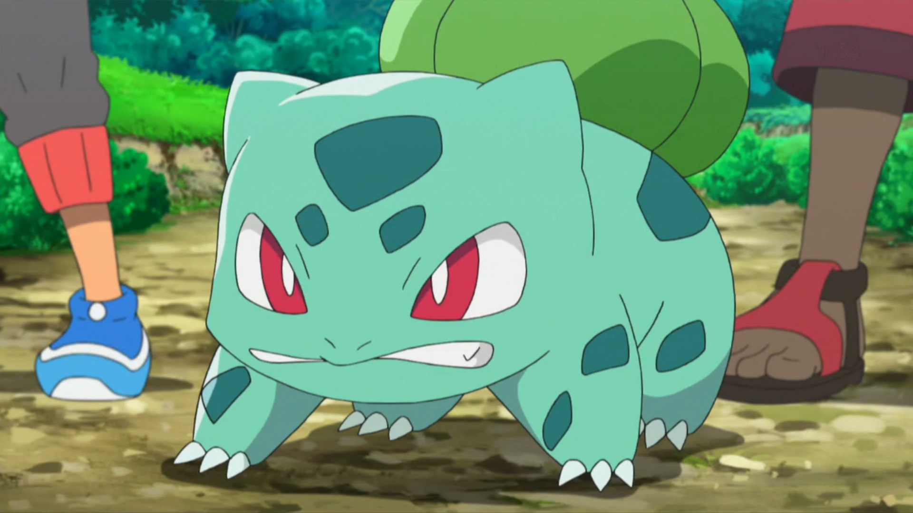

## Do this before class

Read [R4DS](http://r4ds.had.co.nz/) chapter 13.

Solve chapters *Joining Tables* and *Left and Right Joins* of the *Joining Data with dplyr in R* course at [DataCamp](https://www.datacamp.com/enterprise/statistical-data-processing-mt5013/assignments).

## To do during class


### More dental care

During last class you worked with records of adults visiting dental care
```{r, eval = FALSE}
dental_data <- read_csv2("Class_files/Statistikdatabasen_2019-11-14 23_25_40.csv", skip = 1, n_max = 580)
```
join this with [`Class_files/BE0101A5.csv`](https://github.com/MT5013-HT19/Class_files/blob/master/BE0101A5.csv) obtained from [SCB](http://www.statistikdatabasen.scb.se/pxweb/sv/ssd/START__BE__BE0101__BE0101D/MedelfolkFodelsear/#), containing population numbers, and compute number of visits per capita.

### Systembolaget

Download a current version of Systembolaget's assortment using [`Class_files/Systembolaget.R`](https://github.com/MT5013-HT19/Class_files/blob/master/Systembolaget.R) and construct:

- A data-frame of beverages that have been *added* since 2019-10-30 (i.e. beverages in the new file that are not present in [`Class_files/systembolaget2019-10-30.csv`](https://github.com/MT5013-HT19/Class_files/blob/master/systembolaget2019-10-30.csv)).
- A data-frame of beverages that have been *removed* since 2019-10-30.

Any particular types of beverages that has been added/removed?

### Pokemon

Pokemon comes in various types, e.g.\ fire-, water- and grass-type, which affects their strengths and weaknesses in battle. Some are of dual-type.

A table of Pokemon can be loaded by
```{r, message = FALSE, warning = FALSE}
library(tidyverse)
pokemon <- read_csv("https://raw.githubusercontent.com/veekun/pokedex/master/pokedex/data/csv/pokemon.csv")
head(pokemon)
```
(Mac-users may need the `Curl`-package in order to read directly from an  `https`-address), a table of types by

```{r, message = FALSE, warning = FALSE}
types <- read_csv("https://raw.githubusercontent.com/veekun/pokedex/master/pokedex/data/csv/types.csv")
head(types)
```
and finally a table linking pokemon to type by
```{r, message = FALSE, warning = FALSE}
pokemon_types <- read_csv("https://raw.githubusercontent.com/veekun/pokedex/master/pokedex/data/csv/pokemon_types.csv")
head(pokemon_types)
```

We can e.g. see that Pokemon no 1 (bulbasaur) is of type 12 (grass) and type 4 (poison). Join the tables, aiming for a full table like `poke_table` below and investigate how height or weight depends on type.


```{r, echo = FALSE}
poke_table <- mutate(pokemon_types, slot = paste("slot", slot, sep = "")) %>% 
    left_join(types, by = c("type_id" = "id")) %>% 
    select(pokemon_id, slot, identifier) %>% 
    spread(slot, identifier) %>% 
    left_join(pokemon, by = c("pokemon_id" = "id")) %>% 
    select(pokemon_id, identifier, slot1, slot2, height, weight)
```

```{r}
head(poke_table)
```



