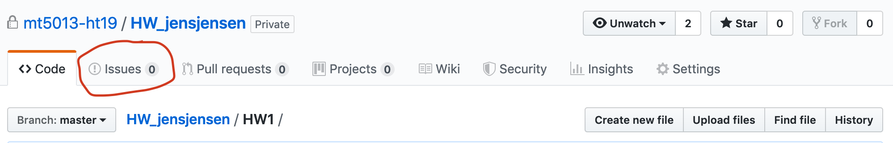

## Assignment

This homework follows up on the activities in the first class. For the assignment (which is essentially a test-run for upcoming assignments) you should follow steps 1-5 below. It is assumed that you are signed in to GitHub in a browser and have the Homework project active in RStudio. You will do all six homework assignments within the same R project/GitHub repository.

1. Create a subdirectory `HW1` in your `Homework` directory.
2. Write an R Markdown document called `HW1.Rmd` in `HW1`, this should contain
    + the document option `output: github_document` in the header,
    + a brief description of your past experiences, if any, of using R, RStudio, R Markdown, Git, Github, ggplot2 and dplyr,
    + a plot, using `ggplot`, of some aspect of a data-set. The data-set should be found on the web (i.e. not one that is preloaded in R or in some package) and you should document any steps taken in retrieving the data. 
    + End the document with a code chunk containing `sessionInfo()` (see end of this document), informing the reader what versions of R and packages you are using.
3. Knit `HW1.Rmd` to create a file `HW1.md` that can be rendered by GitHub. **Commit** your work and **Push** to GitHub. Check using a web-browser that it is all there. Note that also the folder `HW1_files` needs to be committed, or the plots will not show on GitHub.
4. Edit the `README.md` in your `Homework` directory to contain a link to `HW1.md` for easy access.
5. When you are happy with the result, possibly after repeated uses of **Commit** and **Push**, open an issue in your Homework repository (see image below where to find issues) stating "HW1 ready for grading!".


## Peer review

After deadline has passed, you will be given access to another students repository on GitHub. You should provide summary feedback by responding to the "HW1 ready for grading!" issue. In particular, you should check the following:

* Is there a working link from the main repository `README.md` to `HW1.md`?

* Do figures show up on `HW1.md` as expected?

* Was the latest version of R used?


```{r, echo = TRUE}
sessionInfo()
```

