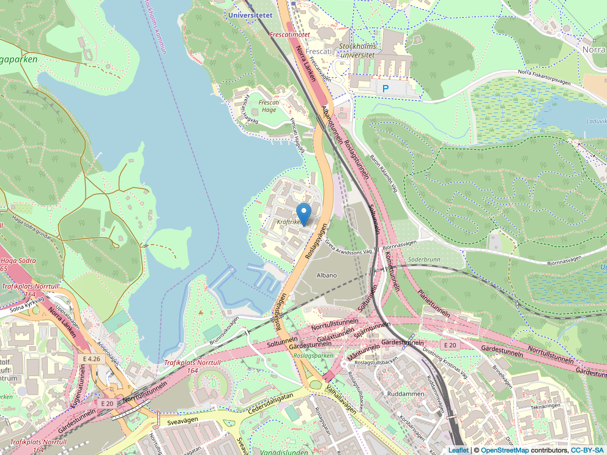

```{r SETUP, echo=FALSE}
knitr::opts_chunk$set(echo = TRUE)
hw_number <- 3
first_sunday <- as.Date("2019-11-10") 
deadline_hw <- first_sunday + (hw_number-1)*7 
deadline_peerreview <- deadline_hw + 3
```
---
title: "HW`r hw_number`: Working with tables"
output: html_document
---

Solutions to the following tasks should, just as for HW1 and HW2, be written in an R-Markdown document with `output: github_document`. Both the R-Markdown document (.Rmd-file) and the compiled Markdown document (.md file), as well as any figures needed for properly rendering the Markdown file on GitHub, should be uploaded to your Homework repository as part of a `HW3` folder. Code should be written clearly in a consistent style, see in particular Hadley Wickham’s [tidyverse style guide](https://style.tidyverse.org/). As an example, code should be easily readable and avoid unnecessary repetition of variable names.

Note that there are new data-sets available in the `HW_data` repository. Downloading them by opening the associated R-project and issue a “pull”. If it fails, delete the `HW_data` folder on your computer and clone the repository again according to the [instructions in HW2](HW2.html).

#### Deadline 

Deadline for the homework is **`r deadline_hw` at 23.59**. Submission occurrs as usual by creating a new issue with the title "HW`r hw_number` ready for grading!" in your repository.

## Exercise 1: Long and wide at Statistics Sweden

Visit Statistics Sweden’s database and solve the following tasks.


### Tasks
a. Choose a table that is on wide format (see textbook), convert it to long format using gather and illustrate something that is easier to do in the latter format.

b. Choose a table that has variables as rows (e.g. separate rows for men and women), turn it into tidy format using spread and illustrate something that is easier to do in the latter format.

## Exercise 2: SL lines

The file [`HW_data/sl-api.sqlite`](https://github.com/mt5013-ht19/HW_data/blob/master/sl-api.sqlite) is a SQLite database containing all SL’s current stops, lines, and the stops on each line. The data are obtained from a call to TrafikLab's [SL Hållplatser och Linjer 2](https://www.trafiklab.se/api/sl-hallplatser-och-linjer-2) API on 2019-11-17 using the `httr` package. Note: [Trafiklab](https://www.trafiklab.se/api/sl-hallplatser-och-linjer-2/dokumentation) has further documentation of the API and the variables. Unfortunately, the data do not contain information about the order in which each line passes the stops. These are available from a different API, and depend on the scheduled trips - we will return to this in exercise 3.

### Tasks

a. Figure out and describe how the tables relate to eachother. 

b. Pull all data from the SQLite database into R as data.frames using the `RSQLite` package. Note: The `SiteId`, `StopPointNumber` and `StopAreaNumber` variables are all of the type `integer` according to the data model, but have not been properly converted as part of the API call. As a consequence, convert them manually to numerical values after importing them into R.

c. Consider the `stopAreas` and `stopPoints` tables and comment on the sparsity of this data presentation. Suggest a more sparse data model for the `stopAreas` table and perform the appropriate table operations to obtain this sparser representation and store it in the data.frame `stopAreas_sparse`. Explain how one would get the original `stopAreas` data.frame using joins.

d. Present a table of the number of active unique rail traffic stops (i.e. train, tram or metro stops in each ticket zone (`ZoneShortName` in `stopAreas`/`stopPoints`). By "active" we mean stops that are part of the journey pattern of a line.

e. Choose a line, and plot the stops as points on a map with the name of each stop as a label. Write the code in such a way that it is easily reusable if you want to plot another line. In order to produce a map use the latitude and logitude coordinates and
generate the plot using [`leaflet`](https://rstudio.github.io/leaflet/) package.
As an example:

```{r}
library(leaflet)

kräftriket <-  data.frame(lon = 18.055, lat = 59.357, name = "Kräftriket")

m <- leaflet(kräftriket) %>% 
    addTiles() %>%  # Add default OpenStreetMap map tiles
    addMarkers(lng=~lon, lat=~lat, popup = ~name) 
m
```

For documents with `output: html_output` or when working with the code in interactive mode you can then just print `m` to see the map. This might, however, not work with 
`.md` files (i.e. github_document) though! Instead, you can
store the Leaflet input into a file and then read and display this again 
with `knitr::includegraphics`:

```{r SAVELEAFLETANDLOAD, echo=TRUE}
#Store leaflet widget as a PNG, see https://stackoverflow.com/questions/31336898/how-to-save-leaflet-in-r-map-as-png-or-jpg-file
library(mapview)
mapshot(m, file = "Leaflet-plot.png")

```


## Exercise 3: Using the SL lines with a reseplan

```{r, echo=FALSE}
#print(getwd())
load(file=file.path("..","..", "Homework", "HW_data", "reseplaner-2019-11-17.RData"))
#time_of_reseplaneren_query <- as.POSIXct("2019-11-17 14:00:54 CET")
```

The purpose of this exercise is to fill the SL line data from Exercise 2 with life!
To this end the file [`HW_data/reseplaner-2019-11-17.RData`](https://github.com/mt5013-ht19/HW_data/blob/master/reseplaner-2019-11-17.RData) contains the result of a query to the [SL Reseplanerare 3.1](https://www.trafiklab.se/api/sl-reseplanerare-31) API done on `r time_of_reseplaneren_query`. Load the data and look at the first suggested trip from the leg list, i.e. `trips$LegList$Leg[[1]]`. Then answer the following questions:

### Tasks

a. From where to where is the journey? How would you answer the question using the `sites` table from Exercise 2?

b. When one would arrive at the destination?

c. Provide a list of all stops that one travels through during the journey. Hint: Use the information stored in `Stops`.

d. Optional: Use the `leaflet::addMarkers` function as done in the previous exercise in order to show all stops on the journey on a map of Stockholm. Furthermore, use the `addPolylines` function of the leaflet package to draw a line between the coordinates of each stop one passes during the journey. 

In the upcoming lecture about `purrr` we will learn to work more efficiently with the above nested structure of lists and data.frames.

## Exercise 4: Peer review

The repo to student review will be assigned at `r deadline_hw + 1`. Deadline for the peer-review is **Wed, `r deadline_peerreview`**. The specific tasks to do during peer review will be announced by a post to the nyhetsforum on `r deadline_hw + 1` or, alternatively, by updating this section of the homework.
