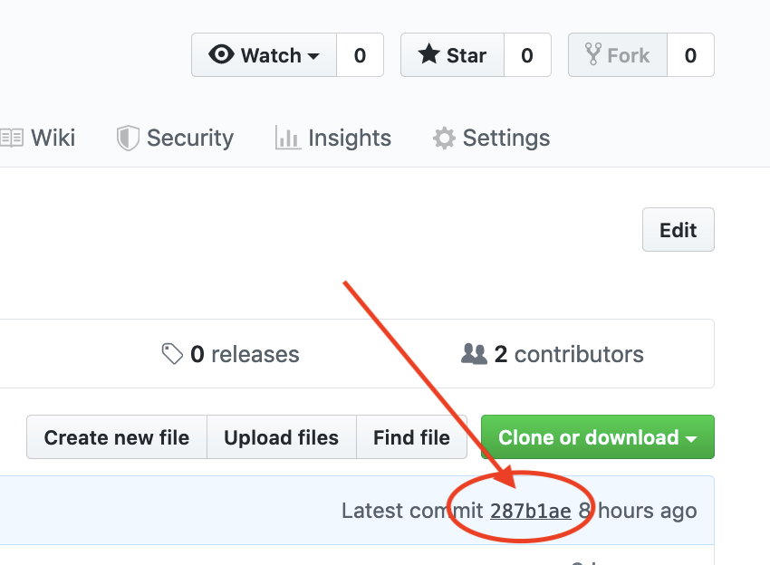

```{r SETUP, echo=FALSE}
knitr::opts_chunk$set(echo = TRUE)
hw_number <- 5
first_sunday <- as.Date("2019-11-10") 
deadline_hw <- first_sunday + (hw_number-1)*7 
deadline_peerreview <- deadline_hw + 3

suppressPackageStartupMessages(library(tidyverse))
suppressPackageStartupMessages(library(stringr))

```
---
title: "HW`r hw_number`: Nobel Tweets"
output: html_document
---

#### Instructions

Solutions to the exercises of this homework `r hw_number` should, just as for HW1-HW`r hw_number-1`, be written in an R-Markdown document with `output: github_document`. Both the R-Markdown document (.Rmd-file) and the compiled Markdown document (.md file), as well as any figures needed for properly rendering the Markdown file on GitHub, should be uploaded to your Homework repository as part of a `HW4` folder. Code should be written clearly in a consistent style, see in particular Hadley Wickham’s [tidyverse style guide](https://style.tidyverse.org/). As an example, code should be easily readable and avoid unnecessary repetition of variable names.

Note that there are new data-sets available in the `HW_data` repository. Downloading them by opening the associated R-project and issue a “pull”. If it fails, delete the `HW_data` folder on your computer and clone the repository again according to the [instructions in HW2](HW2.html).

#### Deadline 

Deadline for the homework is **`r deadline_hw` at 23.59**. Submission occurrs as usual by creating a new issue with the title **"HW`r hw_number` ready for grading"** in your repository. Please also add a link from your repository's `README.md` file to ``HW`r hw_number`/HW`r hw_number`.md``.

## Exercise 1: Lööf vs Löfven

The file [`../HW_data/LoofLofvenTweets.Rdata`](https://github.com/mt5013-ht19/HW_data/blob/master/LoofLofvenTweets.Rdata) contains tables `Loof` and `Lofven` of tweets during the period from 2018-11-20 to 2018-11-30 mentioning “Lööf” and “Löfven”, respectively. The data were fetched from the Twitter API using the R package [`rtweet`](https://cran.r-project.org/web/packages/rtweet/index.html), which provides a convenient R access point to the twitter API. Load the data using the R function `load`.

### Tasks
a. Construct a table `tweets` that joins the two tables and contains a variable `Person` identifying whether the observation comes from the “Lööf” of “Löfven” table. Tweets common to both tables should not be included in the join.

b. Illustrate how the intensity of tweets containing the word “statsminister” (or “Statsminister”) has evolved in time for the `Person`:s using, e.g., histograms with time on the x-axis.

c. Compute and plot the daily average sentiment of words in the tweet texts for the two Person:s. We define the average sentiment as the average strength of words common to the text and the sentiment lexicon at [https://svn.spraakdata.gu.se/sb-arkiv/pub/lmf/sentimentlex/sentimentlex.csv](https://svn.spraakdata.gu.se/sb-arkiv/pub/lmf/sentimentlex/sentimentlex.csv). Note that the function `separate_rows` can be useful in splitting the text into words.

## Exercise 2: Nobel API

The [2019 Nobel lectures](https://www.nobelprize.org/ceremonies/nobel-week-2019/) start this week. The Nobel foundation even maintains an API to look up information about the Nobel Laureates. 

### Tasks:

a. Fetch a list in JSON format with information on the Nobel prizes in Literature from [The Nobel Prize API](https://nobelprize.readme.io/).

b. Extract all the prize motivations from the JSON-list, convert into a character vector of words, remove stop words and visualise the relative frequencies of remaining words in a word-cloud. R-packages for plotting word clouds include e.g. wordcloud, wordcloud2 and ggwordcloud and a list of stop words can be fetched by

```{r, message=FALSE}
stop_words_url <- "https://raw.githubusercontent.com/stopwords-iso/stopwords-en/master/stopwords-en.txt"
stopwords <- read_table(stop_words_url, col_names = "words")
```

## Exercise 3: Peer review

The repo to student review will be assigned at `r deadline_hw + 1`. Deadline for the peer-review is **Wed, `r deadline_peerreview`** at 12:00 (noon). The specific tasks to do during peer review:

### Tasks:

- The main purpose of the peer review is to encourage you to read/consider other people's coding solutions.

- As for the review itself, focus on the positive sides and leave the "marking" to the teachers. You will not be graded by the length of your review. Sometimes a quick "Nice work!" with 1-2 examples of what was nice is sufficient and it may even preferable to a long review submitted late or not submitted at all.

- Furthermore, please connect your comments to a particular revision, you can use the commithash to refer to the commit in the issue, i.e. like

> I've reviewed your commit 287b1ae. Nice work! What I find cool in your code is that...

The commit hash can be found in the upper right corner when looking at the file on github (see screenshot below).



This helps put your comments in context in case future revisions change fundamental things you commented. Reviews in Swedish are fine!


